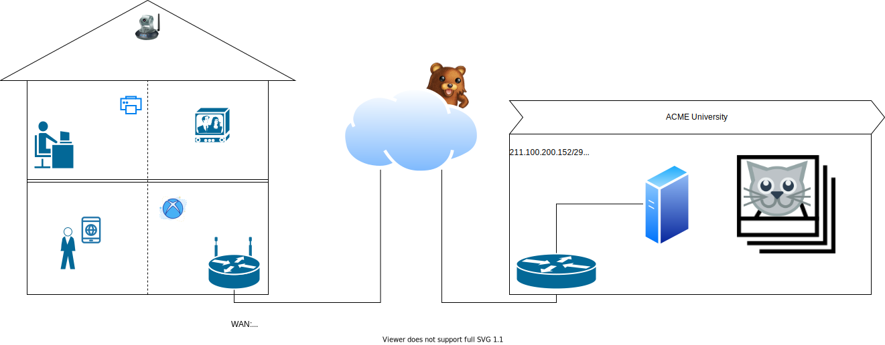
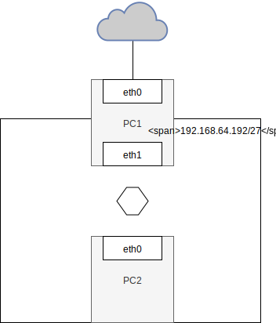

# NAT - Network address translation

## Simulation

Where does the change from private to public address take place?

## Zadanie

1.
   * Prepare a network configuration according to the diagram above.
   * Verify the correct internet connection for ``PC0``
      * addressing
      * DHCP configuration (optional but convenient) 
   * First prepare the ``PC0``, ``PC-1``.
   * Make sure to configure the system parameter ``ip_forward`` for the ``PC0`` correctly.
   * For the configuration, use a proper ``VirtualBox`` configuration that will allow Internet access for the ``PC-1` using the ``eth0`` interface.
   * Perform an address translation configuration to provide Internet access for the `PC-2`.
   * Prepare documentation of the above process
   ** Is there a difference if eth0 address static/dynamic? If so, what difference?

1. 
    * Prepare a network configuration according to the diagram above.
    * Perform address translation configuration to make the ``PC-2` and ``PC-3`'' available for communication with the Internet
    
2. 
    * If the configuration has so far been static, extend the architecture to automatically configure hosts in the ``192.168.64.192/27`` and ``172.16.95.216/29`` subnets using the ``DHCP`` service.

## Homework

1. Familiarise yourself with the term IP Masquerade ``MASQUERADE``.
  
## Materiały

* https://tools.ietf.org/html/rfc1918
* https://linux.die.net/man/8/iptables